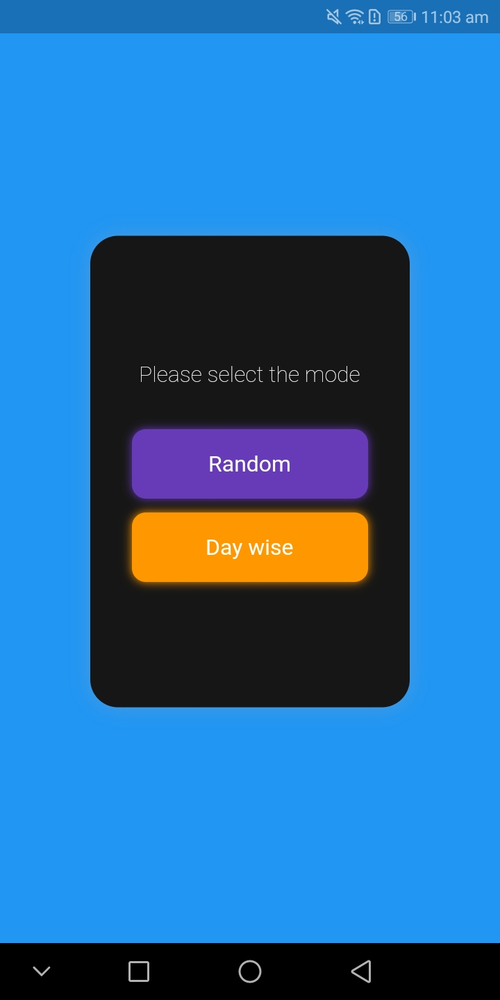
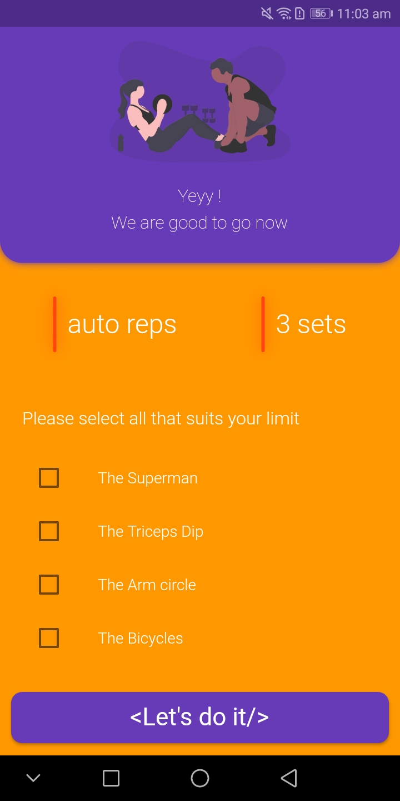
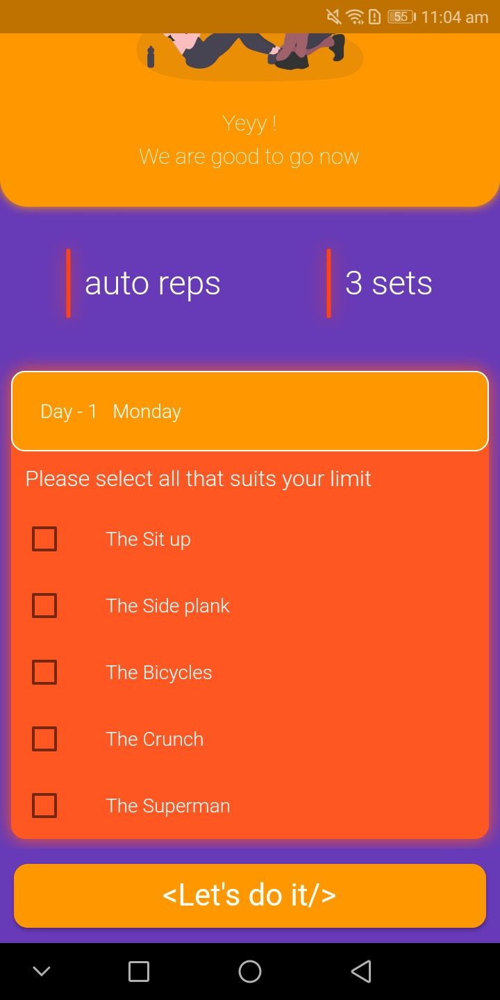
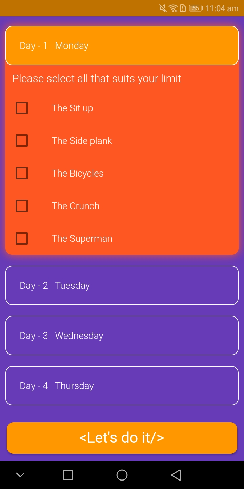
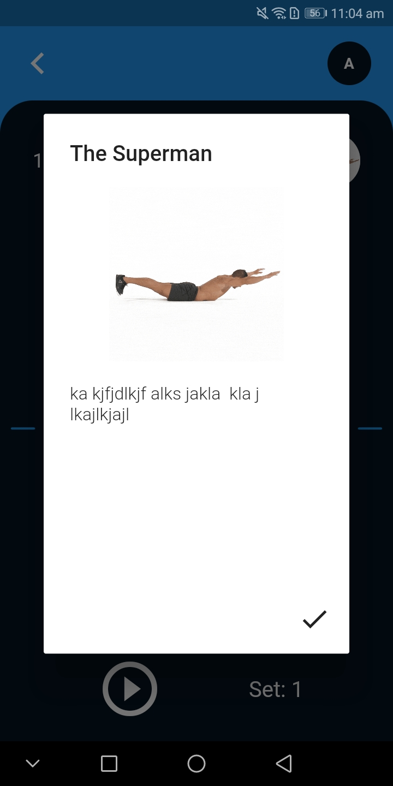
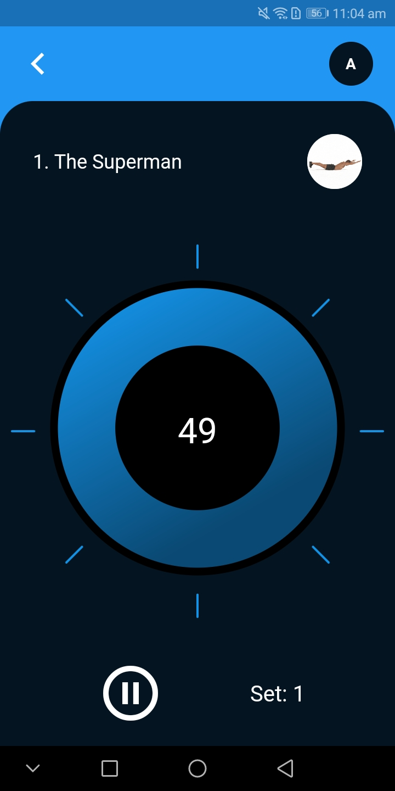

# workmylife

A new Flutter project.

## This is a fitness app that will engineer your body during these lockdown days

### The app has two modes
1. Random mode
2. Daywise mode

### Random mode
Inside the random mode the app with automatically generate random at home exercises for the user to perform. He/she can choose multiple or single exercise that she is capable of doing. You can find a section called reps and sets over the exercise section. There you can select desired number of reps and sets you would like to perform. (auto reps means the app will automatically choose the suitable reps).

### Daywise mode
This is much interesting part of the app. The app will hardcode the user to do specific exercise based on the current day. There are different exersices based on different days and the user cannot change or randomise the exercise. Other parts are same as Random mode.

## Let's do it
When you press let's do it then the app will start and will show you the details (title, description and image) of the exercise you have to perform. (I have used dummy description of the exercise).

## Again there are two modes inside exercise screen
1. Manual Mode.
2. Auto Mode.

## Manual mode
When you select the manual mode then when the timer goes out, the app will ask you to start the exersice or not. You have to do everything manually.

## Auto mode
When auto mode is selected then when the exercise is completed, the app won't ask you to start next exersice rather will automatically change to next exercise without having you to click anywhere.

### Tip - How to know in which mode you are in?
The "M" or "A" on the top right corner decides on which mode you are in. If it is "M" then you are in manual mode, and "A" means you are in auto mode. To change mode, kindly press the letter.

